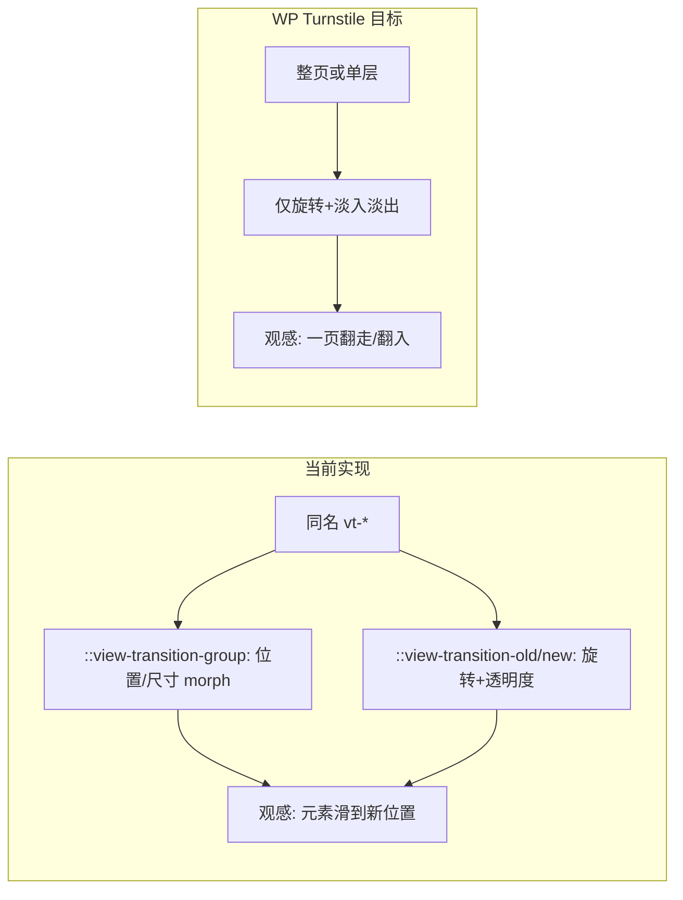

# @umamichi-ui/windows-phone-motion 开发对话转录

> 本文本由 LLM 生成，未经人工检查，请谨慎对待

来源：在 [umamichi.moe](https://github.com/Unnamed2964/umamichi.moe) 集成本包时的 Cursor 对话（2026-05-23～2026-05-24）。下列为用户提问与助手回答的完整转录；工具调用与中间步骤已省略。

## Turn 1 · User

请问 Windows 8/ Windows Phone 的入出场动画是怎样的？请问对应到本项目是怎样的？（你可以尽可能多地请求查找你希望查找的资料来进行更好的回答）

## Turn 1 · Assistant

正在查阅项目中与动画相关的实现，并检索 Windows 8 / Windows Phone 的入出场动画资料。

## Turn 1 · Assistant

下面分两部分：**Windows 8 / Windows Phone 原生的入出场动画体系**，以及**在本仓库 `umamichi.moe` 里实际对应到什么、没对应到什么**。

---

## 一、Windows 8 / Windows Phone 的入出场动画（概念与类型）

微软在 WinRT / Windows Phone 8.1 XAML 里把「过渡」做成 **Transition**（不必手写 Storyboard），大致分 **页面级导航** 和 **控件/内容级出现** 两类。

### 1. 页面导航（Frame.Navigate）

| 类型 | 典型 API / 控件 | 视觉与方向 |
|------|----------------|------------|
| **Turnstile（旋转门）** | `CommonNavigationTransitionInfo`（Phone 默认） | 整页绕 Y 轴做类似「翻页」的 3D 旋转；常配合透明度 |
| **Turnstile Feather（羽化/错峰）** | Toolkit 的 `TurnstileFeatherTransition` + `FeatheringIndex` | 同一页内控件按索引**依次**旋转进入，像消息/Pivot 标题先动、正文后动 |
| **Slide（滑动）** | `SlideNavigationTransitionInfo` | **进入：自下而上**；**退出：自上而下**（也可配置左右等 Mode） |
| **Continuum / Fly away** | `ContinuumNavigationTransitionInfo` | 点击的列表项「飞走」并衔接到下一页（邮件应用风格） |
| **Drill in** | `DrillInNavigationTransitionInfo`（UWP 推荐之一） | 层级下钻感 |
| **Entrance（页面刷新）** | `EntranceNavigationTransitionInfo` | 淡入 + 位移，偏「刷新/首次进入」 |
| **从边缘滑入的面板** | `PaneThemeTransition`、`EdgeUIThemeTransition` | 指定从 Top/Bottom/Left/Right 滑入/滑出 |

Phone 8.1 新建工程默认在 `RootFrame` 上挂 `NavigationThemeTransition`，默认子类型就是 **Turnstile**（见 [Visually Located 的 WP Runtime 转场说明](https://visuallylocated.azurewebsites.net/post/2014/06/24/Page-transitions-and-animations-in-Windows-Phone-Runtime.aspx)）。

### 2. 控件/列表「入场」，而非整页换栈

| 类型 | 行为 |
|------|------|
| **EntranceThemeTransition** | 元素加入可视树时：**淡入 + 从偏移位置滑入**（`FromHorizontalOffset` / `FromVerticalOffset`）；挂在 Panel 上时可 **stagger** 子项 |
| **RepositionThemeTransition** | 布局变化时平滑移动到新位置 |
| **AddDeleteThemeTransition** | 列表增删：插入时撑开空间，删除时滑出并收拢 |
| **Pivot SlideInAnimationGroup** | Pivot 切换时多行文字**分行错峰**滑入 |

WinRT 总思路（[Scott Logic 2011 博文](https://blog.scottlogic.com/2011/10/10/winrt-transitions-creating-fast-and-fluid-metro-uis.html)）：用 `UIElement.Transitions` / `ChildrenTransitions` 响应「加入 UI、重排、增删子项」等事件，而不是瞬间跳变。

### 3. 时序与缓动（体感）

- 时长多在 **约 200–400ms**（AppBar 推挤内容常见 ~200ms + `CubicEase` EaseOut）。
- 导航/主题过渡常用 **ease-out** 类曲线，让动作「快起慢停」。
- Turnstile / Feather 还有 **按元素位置的 BeginTime 错峰**（右侧先动等），这是 Metro「流畅」感的核心之一。

WinJS 时代还有 `WinJS.UI.Animation.enterPage`，把 header、content 等**分组错峰**入场（[旧版 MSDN](https://learn.microsoft.com/en-us/previous-versions/windows/apps/br212672(v=win.10))），语义上接近 Entrance + stagger。

---

## 二、对应到本项目 `umamichi.moe` 的情况

项目**明确声明**受 Windows 8–10 / Metro 视觉启发，但作者也写明 **缓动动画尚未充分复现**：

```14:17:src/content/index.md
- Windows 8-10、Office 2013-2016、Visual Studio 2012-2017（Metro Design）：内容、语义中心，采用纯色色块，不使用阴影，采用隐喻的抽象图标，类似于城市轨道交通导向标识的视觉风格
  ...
  （遗憾的是，我认为构成这一体验的很重要的一部分的缓动动画部分还是没能得以复现）
```

下面按「像 Metro 什么」→「仓库里是什么」对照。

### 1. 站内页面切换（Astro `ClientRouter` + View Transitions API）

- **启用**：`BaseHead.astro` 里有 `<ClientRouter />`。
- **命名分组**：`global.css` 为 header、footer、article、sidebar 等设置了 `view-transition-name`，**仅 footer** 通过 `data-astro-transition-persist` 跨页保留。
- **未做**：仓库里**没有** `::view-transition-old` / `::view-transition-new` 自定义动画。

因此：**不是** Windows 的 Turnstile / Slide / Continuum，而是浏览器 View Transitions 的**默认交叉淡入淡出/几何插值**（若浏览器支持）。这与 Metro 的 3D 旋转门、自下而上整页滑入**不是同一套**。

待办里也还有「换乘指示式」友情链接动画，说明 **Metro 式页面/导航动效仍是规划项**，尚未落地。

### 2. 移动端汉堡菜单 —— 最接近 `Pane` / 边缘滑入 + 内容位移

```185:231:src/styles/global.css
	[data-site-mobile-menu] {
		visibility: hidden;
		transform: translateX(-100%);
		transition: transform 220ms ease, visibility 220ms step-end;
		...
	}
	html[data-mobile-menu-open='true'] [data-site-mobile-menu] {
		transform: translateX(0);
		...
	}
	html[data-mobile-menu-open='true'] body > * main,
	html[data-mobile-menu-open='true'] body > * [data-astro-transition-persist='footer'] {
		transform: translateX(50vw);
		...
	}
```

| Metro 概念 | 本项目实现 |
|------------|------------|
| 从左侧滑入的面板（`PaneThemeTransition` Edge=Left） | 菜单 `translateX(-100%) → 0`，宽 `50vw`（`SiteFrame.tsx`） |
| 内容被推开而非单纯遮罩（部分 Win8 AppBar「squish」思路） | 打开时 **header / main / footer 同步右移 50vw** |
| 遮罩层 | `data-site-mobile-dimmer` 透明度 220ms |
| 典型 Metro ease-out / 3D | **220ms `ease`**，**无**旋转、无 feather 错峰 |

这是全站里**最像 Windows 8「边缘面板 + 主内容平移」**的一段，但仍是 **2D 平移 + 线性 ease**，不是 Phone 默认 Turnstile。

桌面断点（≥48rem）在 `global.css` 里给 header/main/footer 预备了 `transform 420ms ease`，但移动端菜单在 `md` 以上隐藏，这段主要是与导航条动画时长对齐，**不是**桌面侧栏 Turnstile。

### 3. 顶栏「运行线」— 导航切换时的 Metro 式「指示条滑动」

`SiteChromeScripts.astro` 在 `astro:before-preparation` 记录当前线宽，换页后用：

```765:766:src/components/SiteChromeScripts.astro
					currentRunningLine.style.transition = 'width 420ms cubic-bezier(0.22, 1, 0.36, 1)';
					currentRunningLine.style.width = `${toWidth}px`;
```

这对应的是 Metro 里**强调当前项、指示器平滑移动**的动效（类似 Pivot/列表选中条），**不是整页入出场**。`cubic-bezier(0.22, 1, 0.36, 1)` 是偏 **ease-out** 的曲线，比菜单的 `ease` 更接近 Fluent/Metro 常见节奏，但仍**没有** Turnstile 的 3D。

### 4. 错误恢复流 —— Windows 8/WinRE **场景模拟**，不是「页面导航转场」

`ErrorRecoveryExperience.astro` 三阶段：蓝屏收集 → 黑屏启动（`WindowsProgressRing`）→ WinRE 选项。

- 阶段切换：**120ms 透明度**切换，不是导航栈动画。
- 圆环：根据 **Windows 8 开机视频逐帧角度** 反推的行为复刻（见 `WindowsProgressRing.astro` 注释），属于 **ProgressRing / 开机 loading** 语义，不是 `NavigationThemeTransition`。
- 选项区：扁平蓝底 `#2067b2`、大块磁贴式链接，偏 **WinRE 静态 UI**；hover 仅 `background-color 120ms`。

`out-of-site.astro` 是静态确认页，**无**入出场动画设计。

### 5. 其它微交互

- 复制 toast、主题切换：短 opacity/transform 或临时关掉 transition（`data-theme-switching`）。
- Chakra 文章组件：多为 `0.2s ease` 背景色 — 通用 Web，**非** Metro 页面转场。

---

## 三、总对照表（便于扫一眼）

| Windows 8 / Phone 能力 | 本项目现状 |
|------------------------|------------|
| Turnstile / Feather 整页导航 | ❌ 未实现 |
| Slide 自下而上整页 | ❌ 未实现 |
| Continuum / Drill-in | ❌ 未实现 |
| EntranceThemeTransition 错峰入场 | ❌ 未实现（仅错误页阶段淡入） |
| 边缘 Pane + 主内容平移 | ⚠️ **移动端菜单** 部分类似（2D，220ms ease） |
| 导航指示条平滑移动 | ⚠️ **顶栏 running line**（420ms ease-out 曲线） |
| View Transitions 跨页 | ✅ 有命名组 + ClientRouter，**无** Metro 定制 keyframes |
| 开机/ProgressRing 动效 | ✅ `WindowsProgressRing`（错误页专用） |
| Metro 视觉（色块、无阴影、隐喻图标） | ✅ 设计取向 + 地铁导航图标；动效作者自认未完成 |

---

## 四、若要在本项目中「更贴近」Metro 入出场，方向性建议（仅说明，Ask 模式不改代码）

1. **站内换页**：在 `::view-transition-old/new` 上为 `article` / `title` 等写 **slide + fade + 轻微 stagger**，或 forward/back 区分方向 — 对应 `SlideNavigationTransitionInfo` / `EntranceThemeTransition`，仍可与 Astro persist 共存。  
2. **移动菜单**：把 `ease` 换成 Metro 常用的 **cubic-bezier(0, 0, 0.2, 1)** 或 `(0.22, 1, 0.36, 1)`，并考虑菜单项 **FeatheringIndex 式 delay**。  
3. **友情链接等待办**：很适合做 **Turnstile Feather 式** 多图标错峰，与 `index.md` 里「地铁换乘指示」一致。  
4. **不要与错误页混淆**：BSOD/WinRE 是**独立叙事动效**；日常导航应走 View Transitions 或路由层动画，而不是复用 `WindowsProgressRing`。

---

**结论**：Windows 8/Phone 的入出场核心是 **XAML NavigationThemeTransition（默认 Turnstile）+ 各类 ThemeTransition 的滑入/淡入/错峰**；本仓库在**视觉与信息架构**上借鉴 Metro，在**动效**上主要是 **移动菜单平移、导航 running line、Astro 默认 View Transitions、错误页 Windows 8 启动环**，**尚未**复现 Turnstile、Slide 整页、Continuum、Entrance 错峰等标志性导航动画——这与主页自述的「缓动动画未能复现」一致。

若你希望针对某一条路径（例如「只把 Astro 换页做成 Slide」或「只强化移动菜单」）做实现方案，可以切换到 Agent 模式让我按优先级改 CSS/脚本。

## Turn 2 · User

我有 Visual Studio 2013 以及相应的 Windows 8/Phone Kit 的存档，如果你希望，允许你请求获取其中的 xaml 资源
”（遗憾的是，我认为构成这一体验的很重要的一部分的缓动动画部分还是没能得以复现）“，如何使本项目的 transition 更加符合 Windows (Phone) 8 的设计理念、风格和规范？，代码架构如何设计？

## Turn 2 · Assistant

结合当前仓库的 transition 实现，梳理一套更贴近 Windows (Phone) 8 的架构建议；并说明若提供 VS2013 / Kit 中的 XAML，应优先提取哪些资源。

## Turn 2 · Assistant

下面是一份**面向本仓库现状**的设计建议：如何把 transition 做得更像 Windows (Phone) 8，以及代码架构应如何分层。你提供的 VS2013 / Kit 存档**很有价值**，但不必整包搬过来——应**有选择地提取参数与语义**，再映射到 Web 栈（Astro View Transitions + CSS + 少量 JS）。

---

## 1. 先对齐「设计理念」，再选技术

Windows (Phone) 8 的动效不是「到处加 animation」，而是几条原则：

| 原则 | 含义 | 对本项目的约束 |
|------|------|----------------|
| **语义驱动** | 动画说明「从哪来、到哪去、层级关系」 | 顶栏换项 ≠ 文章换页 ≠ 打开菜单 ≠ 错误恢复 |
| **Fast and Fluid** | 短、有方向、ease-out 收尾 | 避免无方向 fade；时长集中在 200–420ms |
| **分层** | Chrome 稳定，内容动；或整页导航 | 你已有 `vt-header` / persist footer，方向正确 |
| **错峰（stagger）** | Feather / Pivot 分行入场 | 友情链接、文章块、菜单项适合用 |
| **可关闭** | 系统设置可关动画 | 必须统一 `prefers-reduced-motion` |
| **2D 优先（Web）** | Phone Turnstile 是 3D Y 轴旋转 | Web 上应用 **slide + fade + 轻微 perspective**，不必真复刻 PlaneProjection |

你在 `index.md` 里说的「缓动没能复现」，核心缺口通常是这三件事：

1. **没有 transition 目录**（时长、曲线、方向分散在 `global.css`、Chakra、`SiteChromeScripts`）
2. **站内换页只有 View Transition 命名，没有 Metro 式 old/new 规则**
3. **各场景混用 `ease` / `linear` / 自定义 bezier**，缺少 Phone 8 那套「同一 family 内一致」

---

## 2. 若提供 VS2013 / Kit 的 XAML，优先要哪些文件

你允许我读取存档时，**最有 ROI** 的不是整页 XAML，而是这些**可量化**资源：

### 高优先级（直接变成 CSS token）

| 来源（典型路径） | 提取内容 |
|------------------|----------|
| `Generic.xaml` / `ThemeResources.xxx.xaml` | `EntranceThemeTransition` 默认 `FromHorizontalOffset`、`Duration` |
| `NavigationThemeTransition` + `*NavigationTransitionInfo` | 各导航类型的 Duration、Forward/Backward 差异 |
| Phone Toolkit / Sample 里的 `TurnstileTransition`、`SlideTransition` Storyboard | KeyTime、DoubleAnimation 的 **From/To/Duration/EasingFunction** |
| `PaneThemeTransition` / `EdgeUIThemeTransition` | Edge 方向与位移量 |
| WinJS sample（若有）`UI.Animation.enterPage` | 分组错峰 delay 表 |

### 中优先级（行为语义）

- `CommonNavigationTransitionInfo` + `IsStaggeringEnabled`
- Pivot `SlideInAnimationGroup` 的 group index → delay 映射
- AppBar Open/Close VisualState（推挤内容的 Y 位移 + CubicEase EaseOut）

### 低优先级（视觉参考，不必代码化）

- 大量 ControlTemplate 里的局部 hover（Button 等）——你已有 Chakra 0.2s，可后补

**建议交付方式**（方便后续 Agent 模式实现）：

```
/transitions-reference/
  entrance-theme-transition.xaml      # 或摘录片段
  navigation-theme-transition.xaml
  turnstile-feather-sample.xaml
  extracted-tokens.json             # 人工或脚本整理的 duration/easing/offset
```

若暂时不能导出文件，至少贴出 Storyboard 里 **Duration + EasingFunction 类型（Cubic/Quadratic/Power）+ EasingMode** 的片段即可。

---

## 3. 本项目的「Transition 分类」——对应 Win8/Phone 8 哪一类

不要把 Turnstile 套在所有地方。建议按 **导航上下文** 映射：

```
┌─────────────────────────────────────────────────────────┐
│  Layer A: Chrome（持久壳）                                 │
│  header, footer(persist), nav running line              │
│  → Reposition / 指示条滑动（已有 420ms bezier）            │
├─────────────────────────────────────────────────────────┤
│  Layer B: Route（Astro ClientRouter 站内换页）            │
│  article, title, sidebar, toc, prev-next                │
│  → SlideNavigation + 部分 Entrance stagger              │
├─────────────────────────────────────────────────────────┤
│  Layer C: Overlay（非路由栈）                             │
│  mobile menu, dimmer, article source menu, copy toast   │
│  → PaneThemeTransition / EdgeUI（左入 + 内容平移）        │
├─────────────────────────────────────────────────────────┤
│  Layer D: In-page（同页 DOM 变化）                        │
│  友情链接布局、TOC 展开、列表增删                          │
│  → EntranceThemeTransition / AddDelete / Feather          │
├─────────────────────────────────────────────────────────┤
│  Layer E: Scene（独立叙事，不参与通用路由）                 │
│  ErrorRecoveryExperience, WindowsProgressRing           │
│  → 保持隔离，不接入 Layer B                               │
└─────────────────────────────────────────────────────────┘
```

与现有代码的对应：

- **Layer A**：`SiteChromeScripts.astro` 的 running line；`vt-header">header/footer`
- **Layer B**：`ClientRouter` + `vt-*` 类名已铺好，**缺** `::view-transition-*` 规则与 forward/back 策略
- **Layer C**：`global.css` 移动菜单 220ms — 应迁入 Layer C 预设并统一 easing
- **Layer D**：`index.md` 待办「友情链接换乘动画」——最适合 Turnstile Feather 语义
- **Layer E**：`ErrorRecoveryExperience.astro` — 已有，**不要**和 B 混用 token

---

## 4. 推荐代码架构（目录与职责）

### 4.1 总体结构

```
src/
  motion/                          # 新：动效子系统（纯 token + 逻辑，无 UI）
    tokens.css                     # CSS 变量：时长、曲线、位移、stagger 步进
    presets.css                    # 命名预设：@keyframes + ::view-transition 规则
    catalog.ts                     # TS：TransitionKind、NavigationDirection、上下文→预设
    stagger.ts                     # 计算 FeatheringIndex → delay
    astro-navigation.ts            # 监听 astro:before-preparation，写 data-nav-direction
    reduced-motion.css             # 统一降级
    index.ts                       # 对外 export

  components/
    MotionProvider.astro           # 可选：注入 tokens + 注册 astro 监听器
    ...现有组件只引用 class / data-motion-*，不写 duration
```

**原则**：

- **所有 duration/easing 只出现在 `motion/tokens.css`**
- **所有 `::view-transition-old/new` 只出现在 `motion/presets.css`**
- **业务组件只声明「我是谁」**（`data-motion="route-content"`、`class="vt-article"`），不声明怎么动
- **`SiteChromeScripts.astro` 里的 inline transition 字符串**逐步改为读 CSS 变量或 class toggle

### 4.2 TypeScript 目录：`catalog.ts` 镜像 XAML 类型

用枚举表达 Win8 语义，而不是直接写 CSS 类名：

```typescript
// 概念示意 —— 非仓库现有代码
export type MetroTransitionKind =
  | 'suppress'           // SuppressNavigationTransitionInfo
  | 'entrance'           // EntranceNavigationTransitionInfo
  | 'slide'              // SlideNavigationTransitionInfo
  | 'drillIn'            // DrillInNavigationTransitionInfo
  | 'pane-left'          // PaneThemeTransition Edge=Left
  | 'reposition'         // RepositionThemeTransition
  | 'addDelete'          // AddDeleteThemeTransition
  | 'feather';           // TurnstileFeather 语义（Web 用 stagger slide）

export type NavigationDirection = 'forward' | 'back' | 'replace';

export function resolveRouteTransition(ctx: {
  fromPath: string;
  toPath: string;
  direction: NavigationDirection;
  viewport: 'mobile' | 'desktop';
}): MetroTransitionKind {
  // 例：同 top-level nav → slide；跨 section → entrance+feather
  // 例：browser back → slide 反向
}
```

**路由策略建议（符合 Metro 语义）**：

| 导航场景 | 预设 | 说明 |
|----------|------|------|
| 同栏目内下一篇/上一篇 | `slide` + forward/back | 类似 Phone SlideLeft/Right |
| 顶栏换一级目录 | `entrance` + 轻 stagger | 新 section「进入」 |
| 浏览器后退 | `slide` 反向 | 必须检测 `navigation.type` / history |
| Header/Footer | `suppress` 或仅 cross-fade | 已有 persist，不宜大幅位移 |
| 打开移动菜单 | `pane-left` | 现有行为，换 token |
| 友情链接区块 | `feather` | 待办第 2 项 |

### 4.3 CSS token 层（从 XAML 反推）

在拿到 Kit 之前，可先用 **Win8/Phone 常见默认值** 占位，再用 XAML 实测替换：

```css
/* 概念示意 */
:root {
  --metro-duration-fast: 200ms;      /* AppBar / 小控件 */
  --metro-duration-normal: 320ms;    /* 页面 slide */
  --metro-duration-chrome: 420ms;    /* 你 running line 已在用 */

  --metro-ease-out: cubic-bezier(0, 0, 0.2, 1);       /* 标准 Decelerate */
  --metro-ease-out-strong: cubic-bezier(0.22, 1, 0.36, 1); /* 你已在 nav line 用 */
  --metro-ease-in-out: cubic-bezier(0.4, 0, 0.2, 1);

  --metro-offset-entrance-x: 40px;   /* 从 XAML FromHorizontalOffset 替换 */
  --metro-offset-entrance-y: 24px;
  --metro-offset-slide-y: 100%;     /* Phone 默认 vertical slide */

  --metro-stagger-step: 35ms;        /* FeatheringIndex * step */
}
```

**关键**：从 VS2013 抽到的不是「magic number 信仰」，而是 **同一套数字在所有场景复用**。

### 4.4 View Transitions 层：`presets.css`

你已有命名组：

```91:125:src/styles/global.css
.vt-header { view-transition-name: header; }
.vt-footer { view-transition-name: footer; }
...
.vt-prev-next { view-transition-name: prev-next; }
```

下一步应补 **old/new 动画 + 分组策略**，例如：

```css
/* 概念示意 */
html[data-route-transition="slide"][data-nav-direction="forward"]::view-transition-old(article) {
  animation: metro-slide-out-up var(--metro-duration-normal) var(--metro-ease-out) both;
}
html[data-route-transition="slide"][data-nav-direction="forward"]::view-transition-new(article) {
  animation: metro-slide-in-up var(--metro-duration-normal) var(--metro-ease-out) both;
}

/* sidebar/toc：较小位移 + stagger delay */
::view-transition-new(sidebar) { animation-delay: calc(var(--metro-stagger-step) * 1); }
::view-transition-new(toc)      { animation-delay: calc(var(--metro-stagger-step) * 2); }
```

**注意**：

- View Transition 组不宜过多同时动画（性能 + 可读性）。Metro 也是「整页为主、局部 stagger」。
- `title`、`hero-image` 可 stagger；`header`/`footer` 建议 **suppress 大位移**，只 opacity。

### 4.5 Astro 集成：`astro-navigation.ts`

在 `astro:before-preparation` / `astro:page-load` 写根节点属性：

```typescript
// 概念示意
document.documentElement.dataset.navDirection = inferDirection(event);
document.documentElement.dataset.routeTransition = resolveRouteTransition(...);
```

这与现有 running line 钩子同层：

```836:840:src/components/SiteChromeScripts.astro
document.addEventListener('astro:before-preparation', () => {
  // 已有：记录 running line 宽度
});
```

**建议合并为一个 `initSiteNavigationMotion()`**，避免多个 listener 竞态。

### 4.6 Chakra / React 边界

`ArticleLayout.tsx`、`SiteFrame.tsx` 是 React 岛。动效架构上：

- **路由级**：CSS View Transitions（跨 swap 存活的是 persist 元素 + 快照）
- **组件级 hover**：继续 Chakra `transition="..."`，但值改为 `var(--metro-duration-fast)` 或通过 Chakra theme extension 引用 token
- **不要在 TSX 里写 `@keyframes`**，避免 Astro/React 双份维护

### 4.7 `WindowsProgressRing` 的定位

保持 **`src/components/WindowsProgressRing.astro` + Layer E**，不要并入 `motion/presets.css`。它是「开机环行为复刻」，不是导航 TransitionInfo。

---

## 5. Turnstile / Feather 在 Web 上的务实做法

Phone 8 Turnstile 本质是：

- `RotationY` + `Opacity` + **按 X 坐标排序的 BeginTime**

Web 等价实现（无需真 3D）：

```css
@keyframes metro-feather-in {
  from {
    opacity: 0;
    transform: translate3d(var(--metro-offset-entrance-x), 0, 0)
               rotateY(-12deg);
  }
  to {
    opacity: 1;
    transform: none;
  }
}
```

- 友情链接每个 tile：`style={{ animationDelay: \`${index * var(--metro-stagger-step)}\` }}` 或 `data-feather-index`
- **移动端可减弱 rotateY**（`prefers-reduced-motion` 时只 fade）
- 这与 `index.md`「地铁换乘指示」视觉 + Phone 开始屏幕 Feather **语义一致**

---

## 6. 与 Astro Transitions 的兼容要点

你项目已在用：

- `<ClientRouter />`
- `data-astro-transition-persist="footer"`
- 多处 `astro:after-swap` 清理状态（菜单、主题、TOC）

架构上必须保证：

1. **换页动画开始前**关闭 overlay（菜单），否则 `transform: translateX(50vw)` 会污染 View Transition 快照
2. **`data-theme-switching`** 模式扩展到 **`data-motion-suppressed`**（换页期间禁止 Chakra hover transition）
3. **persist 元素**（footer）在 Metro 语义里是 chrome — 动画应 minimal
4. **不支持 View Transitions 的浏览器**：`@supports not (view-transition-name: none)` 下降为 instant 或仅 `opacity 120ms`

---

## 7. 分阶段落地顺序（建议）

| 阶段 | 内容 | 收益 |
|------|------|------|
| **P0** | `motion/tokens.css` + 把 `global.css` / running line / 菜单时长迁入 | 立刻统一「缓动感」 |
| **P1** | `presets.css` 为 `article` + forward/back slide；`astro-navigation.ts` | 解决 index.md 最大痛点：站内换页 |
| **P2** | 移动菜单改用 `pane-left` preset + 菜单项 feather | Layer C 完整 |
| **P3** | 友情链接 `feather` 组件化 | 待办第 2 项 |
| **P4** | 用 Kit XAML 实测值替换 token；可选 determinate ProgressRing | 精确对齐 Win8 |

---

## 8. 若你接下来提供 XAML，我建议的具体请求清单

请从 VS2013 / Windows Phone SDK 存档中任选其一带出（文本摘录即可）：

1. **Windows Phone 8.1 空白模板**里 `App.xaml.cs` 的 `RootFrame` + 默认 `ContentTransitions`
2. **Transition sample**（Microsoft sample 或 Toolkit）里 Turnstile / Slide 的 Storyboard 完整 KeySpline 或 EasingFunction
3. **`Generic.xaml`** 中 `EntranceThemeTransition` 相关 ThemeResource（若有独立 Duration resource）
4.       **NavigationThemeTransition` 默认子类型**是 Common 还是 Slide（Phone vs Win8 差异）

有了这些，可以把 `--metro-duration-*` 和 `--metro-ease-*` 从「合理猜测」变成「与 Kit 一致的可追溯常量」，并在仓库里用 `transitions-reference/extracted-tokens.json` 做注释来源（不必给用户看的大文档，一个 JSON + 短注释就够）。

---

## 9. 总结

- **设计理念**：按 Metro 的 **导航语义分层**，不要一种动画走天下；Chrome 稳、内容动、Overlay 独立、错误页隔离。
- **架构**：新增 `src/motion/` 作为 **Transition Catalog + Token + Astro 路由绑定**；现有 `vt-*` 命名保留，动画规则集中进 `presets.css`。
- **缓动复现的关键**：不是再写几个 `transition: 220ms ease`，而是 **从 XAML 提取 Duration/Easing/Stagger → CSS 变量 → 全站唯一来源**。
- **VS2013 存档**：欢迎提供；优先 Storyboard/Easing 与 ThemeTransition 片段，我可据此给出更精确的 token 表和 `catalog.ts` 路由矩阵。

若你切换到 **Agent 模式**，我可以按 **P0 + P1** 先搭 `src/motion/` 骨架并把 `global.css` 里的分散时长收拢；若你先导出 XAML 片段到仓库某路径，也可以先做 **token 校准版** 再写 CSS。你更想先做「站内换页 slide」还是「移动菜单 + feather」？

## Turn 3 · User

Windows 8/8.1 Kit 位于 D:\Windows Kits
Windows Phone 8 Kit 的 Design 文件夹位于 D:\wp8 Design

## Turn 3 · Assistant

正在探索你提供的 Kit 路径，查找与导航/主题过渡相关的 XAML 与动画资源。

## Turn 3 · Assistant

我已在你给出的两个路径里做了只读扫描。结论先说：**能直接量化的动画参数主要在 Win8.1 Kit 的 `generic.xaml`；Phone Design 文件夹主要是主题与控件模板，不含 Turnstile/页面导航的 Storyboard。** 下面把发现、可落地的 token、以及建议的代码架构写在一起。

---

## 1. 两个路径各自有什么

### `D:\wp8 Design`（Windows Phone 8 Design）

约 26 个 XAML，核心是：

| 文件 | 内容 | 对 transition 的价值 |
|------|------|----------------------|
| `ThemeResources.xaml` / `Light` / `Dark` | 色板、字号、边距 | 视觉规范，不是动效曲线 |
| `System.Windows.xaml` | Button、ListBox、ProgressBar 等 **Silverlight 模板** | 多为 `KeyTime="0"` 的瞬时状态切换 |
| `AccentColors\*.xaml` | 强调色 | 无动画 |

**未发现**：`EntranceThemeTransition`、`NavigationThemeTransition`、`Turnstile`、`SlideNavigation` 等页面级过渡。

**仍有用的小参数**（可进 token，但不是「换页动画」）：

- `PhonePivotUnselectedItemOpacity`: **0.4**（Pivot 未选中项透明度）
- `PivotHeaderFontSize`: **72**
- `PhoneTouchTargetOverhang`: **12**（触摸目标外扩）
- ScrollViewer 滚动条显示：`VisualTransition GeneratedDuration="00:00:00.5"` → **500ms**

Phone 的 **ProgressBar** 在 Design 里是 4px 横条 + 不确定态小方块，**不是** Win8.1 的 `ProgressRing` 弧段动画。

### `D:\Windows Kits\8.1\Include\winrt\xaml\design\generic.xaml`

这是 Win8.1 **设计时** 的巨型主题字典（约 9000+ 行），**最有价值**：

| 区域 | 行号附近 | 可提取内容 |
|------|----------|------------|
| **ProgressRing** 默认模板 | ~7004–7183 | 周期 **~3.217s** 一轮；6 个弧 **BeginTime 错开 167ms**（0 / 0.167 / 0.334 / 0.501 / 0.668 / 0.835s）；旋转 `Angle` 的 **KeySpline** 表 |
| **ProgressBar** 不确定态 | ~6727–6796 | 容器 **3.917s**；椭圆位移常用 `KeySpline="0.4,0,0.6,1"` |
| **ListView** 拖拽/重排 | ~5589、5615 | `GeneratedDuration="0:0:0.2"` → **200ms** |
| **ListView** 选择提示 | ~5410 | **650ms** |
| **RepositionThemeAnimation** | ~6707、7743 | 进度条、Toggle 的「位移补间」语义 |

**同样没有**：`NavigationThemeTransition` / Turnstile 的 XAML 实现——它们在 **WinRT 本机组件**（`Windows.UI.Xaml.dll`）里，Kit 里只有 C++ 头文件接口（如 `windows.ui.xaml.media.animation.h`），没有 Storyboard。

---

## 2. 从 Kit 可直接写进项目的「官方数字」

下面这些可以放进未来的 `src/motion/extracted-tokens.json`（来源：`D:\Windows Kits\8.1\Include\winrt\xaml\design\generic.xaml`）。

### ProgressRing（与你们 `WindowsProgressRing.astro` 强相关）

```text
周期（单段弧 Angle 动画）: 0 → 3.217s（RepeatBehavior=Forever）
点与点错峰（Opacity BeginTime）: 0, 167ms, 334ms, 501ms, 668ms, 835ms  （即 167ms 步进）

常用 KeySpline → CSS cubic-bezier:
  0.4, 0, 0.6, 1     （椭圆平移段，多处）
  0.13, 0.21, 0.1, 0.7
  0.02, 0.33, 0.38, 0.77
  0.57, 0.17, 0.95, 0.75
  0, 0.19, 0.07, 0.72
  0, 0, 0.95, 0.37
```

说明：你们错误页上的环若要对齐 **Win8.1 控件 ProgressRing**，应以这份 XAML 为准做校准；开机视频逐帧是另一层（OEM 启动），不必与 `generic.xaml` 混为一谈。

### 其它可复用时长

| Token 建议名 | 值 | Kit 依据 |
|--------------|-----|----------|
| `--metro-duration-reorder` | 200ms | ListView `NotDragging` / `NoReorderHint` |
| `--metro-duration-selection-hint` | 650ms | ListView `NoSelectionHint` |
| `--metro-duration-scroll-chrome` | 500ms | Phone Design ScrollViewer；Win8 滚动相关 Fade |
| `--metro-duration-progress-pause-resume` | 250ms | ProgressBar `Paused→Determinate` opacity |
| `--metro-ease-standard` | `cubic-bezier(0.4, 0, 0.6, 1)` | ProgressBar 不确定态椭圆 |

### 你们项目里应对齐的调整方向

| 现状 | Kit 启示 |
|------|----------|
| 移动菜单 **220ms `ease`** | 更接近 Pane/推挤：建议 **~320ms** + 上表某一组 `cubic-bezier`，而不是 `ease` |
| 导航 running line **420ms** `cubic-bezier(0.22, 1, 0.36, 1)` | 可保留为 **chrome 专用**；与 ProgressRing 的 spline 族区分开 |
| 站内换页无 `::view-transition-*` 规则 | 需单独设计；Kit **不提供** Turnstile 参数，要另找样本 |

---

## 3. 还缺什么：Turnstile / 页面导航要从 VS2013 存档里找什么

以下通常 **不在** `D:\wp8 Design` 和 `generic.xaml` 里，而在 VS2013 / Phone SDK 安装目录或示例工程中。若你愿意继续提供路径，优先这些：

1. **Windows Phone 8.1 空白应用** 或 **Navigation 示例** 里的 `App.xaml.cs`（`RootFrame` + `ContentTransitions`）
2. **Windows Phone Toolkit**（旧 CodePlex 安装目录）里含 `TurnstileTransition` / `TurnstileFeatherTransition` 的 XAML
3. **Transition Sample**（Visually Located 提到的 ZIP，或 SDK Samples）
4. 若有：**Blend for Visual Studio** 附带的 Transition 示例项目

在 VS2013 默认安装里，常见位置（你可对照存档是否有一份拷贝）：

- `C:\Program Files (x86)\Microsoft SDKs\Windows Phone\v8.1\Design\`（可能与你的 `D:\wp8 Design` 同源）
- `C:\Program Files (x86)\Microsoft SDKs\Windows Phone\v8.1\ExtensionSDKs\`
- VS2013 下的 `ProjectTemplates` 里 `Windows Phone` 分类

把其中 **任意一个含 `TurnstileTransition` 或 `SlideTransition` 的 .xaml** 拷进仓库 `transitions-reference/`，就能补全「路由层」token。

---

## 4. 架构设计（结合 Kit 实测 + 你们现有结构）

在上一轮「五层 Layer」基础上，用本次扫描结果 **收紧实现边界**：

```
src/motion/
  tokens.css              ← 只放从 Kit 抽的数字（上表）
  presets.css             ← ::view-transition-*、@keyframes、data-motion 属性选择器
  catalog.ts              ← 路由/overlay/in-page 选 preset（枚举对齐 XAML 类型名）
  astro-navigation.ts     ← before-preparation：direction + preset + 关菜单
  stagger.ts              ← featherIndex × 167ms（ProgressRing 步进可复用为通用 stagger）
  extracted-tokens.json   ← 带来源路径注释（Kit 行号 / wp8 Design key）
  reduced-motion.css

src/components/WindowsProgressRing.astro   ← Layer E，可对齐 generic.xaml ProgressRing
src/styles/global.css                    ← 仅 @import motion；删掉分散的 220ms/420ms 字面量
src/components/SiteChromeScripts.astro   ← running line 只改 class，不写死 bezier 字符串
```

### 预设与 Kit 的映射（实现时用的「规范表」）

| `catalog.ts` 预设 | Win8/Phone 语义 | 本项目落点 | Kit/Design 依据 |
|-------------------|-----------------|------------|-----------------|
| `suppress` | SuppressNavigationTransitionInfo | `header`/`footer` persist 区 | 惯例 |
| `slide-forward` / `slide-back` | SlideNavigationTransitionInfo | `vt-article`、`vt-title` | **需 Toolkit 样本补时长** |
| `entrance-stagger` | EntranceThemeTransition + 子项 delay | 友情链接、文章块 | stagger 步进可先借用 **167ms**（ProgressRing）或样本值 |
| `pane-left` | PaneThemeTransition Edge=Left | 移动菜单 + 主内容 `translateX` | 时长用 **320ms + 0.4,0,0.6,1** 作初值 |
| `reposition` | RepositionThemeTransition | running line 宽度变化 | 已有 420ms；可加 `FromHorizontalOffset` 语义 |
| `fade-fast` | FadeInThemeAnimation | toast、小 overlay | ~200–250ms（Kit 多处） |
| `scene-*` | 非导航 | ErrorRecovery | 不进 `catalog` |

### Astro 集成要点（不变，但加一条 Kit 结论）

- **换页前**必须关移动菜单，否则 `translateX(50vw)` 会污染 View Transition 快照。
- **ProgressRing 组件**继续独立；校准时用 `D:\Windows Kits\8.1\...\generic.xaml` 第 7004–7183 行，而不是 Phone Design 的 ProgressBar。
- **Phone Design** 更适合校准 **颜色、字号、Pivot 透明度、边距**，写入 `@umamichi-ui` / 站点 CSS 变量，而不是 route transition。

---

## 5. 建议的 `extracted-tokens.json` 骨架（你可直接放进仓库作 SSOT）

```json
{
  "sources": {
    "win81_generic": "D:/Windows Kits/8.1/Include/winrt/xaml/design/generic.xaml",
    "wp8_design": "D:/wp8 Design/ThemeResources.xaml"
  },
  "durations": {
    "progressRingCycle": "3217ms",
    "progressRingDotStagger": "167ms",
    "listReorder": "200ms",
    "listSelectionHint": "650ms",
    "scrollChrome": "500ms",
    "progressResume": "250ms",
    "routeSlide": "TBD_FROM_TOOLKIT",
    "paneOpen": "320ms"
  },
  "easings": {
    "standard": "cubic-bezier(0.4, 0, 0.6, 1)",
    "progressRingRotate": [
      "cubic-bezier(0.13, 0.21, 0.1, 0.7)",
      "cubic-bezier(0.02, 0.33, 0.38, 0.77)",
      "cubic-bezier(0.57, 0.17, 0.95, 0.75)",
      "cubic-bezier(0, 0.19, 0.07, 0.72)",
      "cubic-bezier(0, 0, 0.95, 0.37)"
    ],
    "chromeRunningLine": "cubic-bezier(0.22, 1, 0.36, 1)"
  },
  "opacity": {
    "pivotUnselected": 0.4
  }
}
```

---

## 6. 对你问题的直接回答

**如何让 transition 更符合 Windows (Phone) 8？**

1. **分层**：路由（View Transitions + slide/back）、壳（reposition）、面板（pane-left）、场景（错误页）分开，不要共用一个 `ease`。
2. **数字化**：以 `generic.xaml` 的 ProgressRing / ListView 时长与 spline 为 **Win8.1 侧 SSOT**；以 `wp8 Design` 为 **排版/对比度 SSOT**；Turnstile/slide 从 VS2013 样本补 `routeSlide`。
3. **Web 务实**：Turnstile 用 **slide + fade + 167ms 级 stagger + 可选小角度 rotateY**，不必真 3D PlaneProjection。
4. **统一降级**：`prefers-reduced-motion` 与现有 `data-theme-switching` 同级处理。

**代码架构**：新增 `src/motion/` 作为唯一动效源；`vt-*` 只负责命名；`SiteChromeScripts` 只发 `data-nav-direction` / `data-route-transition`；Chakra 只引用 CSS 变量。

---

## 7. 若你下一步愿意提供的文件

按优先级：

1. VS2013 / Phone SDK 里任意含 **`TurnstileTransition`** 的 `.xaml`（补路由层）
2. 确认 `D:\wp8 Design` 是否与 `...\Windows Phone\v8.1\Design` 完全一致（若一致，就不必再找 Phone Design）
3. 可选：把 `generic.xaml` 中 **7004–7183 行** 复制到仓库 `transitions-reference/win81-progress-ring.xaml`（方便 diff 与 `WindowsProgressRing` 对齐）

我当前是 **Ask 模式**，不能替你改仓库；若你切换到 **Agent 模式**，可以按 **P0（tokens + 收拢 global.css）→ P1（view-transition slide + astro-navigation）** 落地，并在拿到 Turnstile 样本后只改 `extracted-tokens.json` 里的 `routeSlide` 一项完成校准。

## Turn 4 · User

这是 fork 到的 WindowsPhoneToolkit：C:\Users\Umamichi\Desktop\WindowsPhoneToolkit
请总结你认为哪里适合使用哪些 transaction，是否适合提取为 umamichi-ui 下可供其他项目复用的基础设施

## Turn 4 · Assistant

正在分析 WindowsPhoneToolkit 中的过渡实现，并对照本项目与 umamichi-ui 的复用可行性。

## Turn 4 · Assistant

已阅读 `C:\Users\Umamichi\Desktop\WindowsPhoneToolkit` 中 **Storyboards** 与 **TurnstileFeatherEffect** 的实现。Toolkit 的动画参数是**可量化、可移植到 CSS** 的；C#/XAML 运行时本身**不适合**直接放进 `@umamichi-ui`。下面按「每种 transition → umamichi.moe 用法 → 是否进 umamichi-ui」说明。

---

## Toolkit 里有什么（与导航相关）

实现集中在：

- `Microsoft.Phone.Controls.Toolkit/Transitions/Storyboards/*.xaml`（整页 Storyboard）
- `Effects/TurnstileFeatherEffect.cs`（页内 Feather 常量）
- 样本：`PhoneToolkitSample/Samples/TransitionsSample.xaml`、`FeatheredTransitionsSample*.xaml`

| 家族 | 模式（节选） | 官方参数摘要 |
|------|----------------|--------------|
| **Turnstile** | ForwardIn/Out, BackwardIn/Out | 进：**350ms**，Y 从 **±80°→0**，`ExponentialEase` EaseOut **Exponent=6**；出：**250ms** 到 **±50°**；透明度进页几乎瞬时（0.01s 到 1） |
| **TurnstileFeather** | 同上 + `FeatheringIndex` | 单元素 **350ms**（进）/ **250ms**（出）；错峰 **ForwardIn 40ms**、**ForwardOut 50ms**、**BackwardIn 50ms**、**BackwardOut 40ms**；起始角 ±80°/±50°；旋转中心 **CenterOfRotationX = -0.2** |
| **Slide** | Up/Down/Left/Right × FadeIn/Out | 位移 **200px**；纵向 **350ms**，横向 **500ms**；同样 ExponentialEase EaseOut Exp=6 |
| **Swivel** | Forward/Backward In/Out 等 | RotationX **±45°**，**350ms** |
| **Rotate** | 90°/180° 顺逆时针 | 整页旋转，博客站一般不用 |
| **Roll** | 单一 | RotationZ **0→90°**，约 **600ms**，偏炫技 |

样本里**默认整页导航**几乎都是四套 Turnstile（与 WP8 系统一致）：

```25:43:C:\Users\Umamichi\Desktop\WindowsPhoneToolkit\PhoneToolkitSample\Samples\TransitionsSample.xaml
    <toolkit:TransitionService.NavigationInTransition>
        ...
                <toolkit:TurnstileTransition Mode="ForwardIn"/>
        ...
                <toolkit:TurnstileTransition Mode="BackwardOut"/>
```

Feather 样本说明：作用于**页内元素**，不是只动 Page 外壳。

---

## 在 umamichi.moe 里：哪里适合用哪种 transition

结合你们现有结构（`ClientRouter` + `vt-*`、`SiteFrame` 移动菜单、running line、`ErrorRecoveryExperience` 隔离）：

### 适合用（与 Metro 语义一致）

| 场景 | 推荐 Toolkit 预设 | 作用区域 | 说明 |
|------|-------------------|----------|------|
| **站内文章/文档换页**（Astro） | **Turnstile**（默认）或 **SlideLeftFadeIn / SlideRightFadeIn** | `vt-article`、`vt-title`，`header`/`footer` 尽量 suppress | Turnstile 对齐 `index.md` 的 WP8 灵感；若桌面用户易晕 3D，可降级为 Slide 横向 |
| **浏览器后退 / 前进** | **BackwardIn/Out** 或 Slide 反向 | 同上 + `data-nav-direction` | 必须与 forward 成对，Toolkit 样本即 Forward/Backward 分设 |
| **上一篇 / 下一篇** | **SlideLeftFadeIn**（前进）、**SlideRightFadeIn**（后退） | `vt-prev-next` 可随 article 一组 | 横向 500ms + 200px 比 Turnstile 更符合「同栏阅读」 |
| **顶栏换一级目录** | **Turnstile** 或轻量 **SlideUpFadeIn** | 整页 `article` 区 | 换「栏目」可用略强动效；`vt-header` 保持不动 |
| **友情链接 / 待办「换乘指示」** | **TurnstileFeather** | 每个链接/图标 `data-feather-index` | 与 Toolkit 设计意图一致；40–50ms × index |
| **文章首屏块**（标题、标签、hero） | **TurnstileFeather**（低强度） | `vt-title`、`vt-tags`、`vt-hero-image` | 可选；勿与 View Transition 双重动画打架 |
| **移动汉堡菜单** | **SlideLeftFadeIn** 语义（非 Turnstile） | `data-site-mobile-menu` + 主内容平移 | 你们已是「左 pane + 内容右推」；应对齐 **500ms / 200px** 或纵向 **350ms**，换掉 `220ms ease` |
| **顶栏 running line** | （Toolkit 无） | 保持站点逻辑 | 继续用 Reposition 式宽度动画；可用 Toolkit 的 **350ms** 作 chrome 时长参考 |

### 不适合或应慎用

| 场景 | 原因 |
|------|------|
| **错误页 / WinRE**（`ErrorRecoveryExperience`） | 独立叙事；用场景时间轴，不要套 NavigationIn/Out |
| **`out-of-site`、静态错误码页** | 无导航栈 |
| **Chakra 按钮 hover** | Phone Design 多为离散切换；与 Turnstile 无关，保持短背景色即可 |
| **Swivel / Rotate / Roll** | 手机竖屏语义强，桌面博客易显突兀 |
| **全站强制 Turnstile 3D** | 需 `prefers-reduced-motion` 降级为 Slide 或 instant |

### 与 Win8.1 Kit 的分工

- **页面 Turnstile / Slide 时长与角度**：以 **WindowsPhoneToolkit Storyboards** 为准（已给出 350/250/500ms）。
- **ProgressRing / ListView 200ms 等**：仍以 `D:\Windows Kits\8.1\...\generic.xaml` 为准；与 Toolkit 导航层互补。

---

## 是否适合提取为 `@umamichi-ui` 基础设施

### 适合放进 umamichi-ui 的（推荐）

| 层级 | 内容 | 形式 |
|------|------|------|
| **设计 token** | 上表 Duration、位移 200px、角度 ±80°/±50°、Feather delay 40/50ms | `metro-motion/tokens.css` + `extracted-from-wptoolkit.json` |
| **CSS 预设** | `@keyframes` 对应 `TurnstileForwardIn.xaml` 等；`::view-transition-*` 规则 | `presets/route-turnstile.css`、`presets/route-slide.css`、`presets/feather.css` |
| **约定** | `data-motion="route-turnstile"`、`data-feather-index`、`data-nav-direction` | 文档进 conventions 或包 README |
| **无障碍** | `prefers-reduced-motion: reduce` 统一关 3D/长动画 | `reduced-motion.css` |

与现有 **`@umamichi-ui/common-css`** 的关系：

- **common-css**：色、字、按钮、文章排版 — 继续不管动效。
- **新包**（建议名 **`@umamichi-ui/metro-motion`** 或 **`@umamichi-ui/motion`**）：只依赖 CSS，任何 Astro/Vite/React 站可 `@import`。
- **不要**把 Astro 专用逻辑塞进 common-css；若需要，另做可选 **`@umamichi-ui/astro-motion`**（`astro:before-preparation` 钩子），避免非 Astro 项目被拖累。

### 不适合作为「可复用基础设施」原样搬移的

| Toolkit 组件 | 原因 |
|--------------|------|
| `TransitionFrame`、`TransitionService` | Silverlight Phone 导航栈专用 |
| `Transitions.cs` + 运行时加载 `.xaml` Storyboard | Web 无等价物；应**预编译为 CSS** |
| `TurnstileFeatherEffect` 整棵视觉树遍历 | DOM 成本高；Web 用 **`animation-delay: calc(var(--metro-feather-step) * index)`** 即可 |
| 整包 C# 依赖 | 与 umamichi-ui 技术栈无关 |

### 许可

Toolkit 为 **Ms-PL**。若在 `@umamichi-ui/motion` 中**逐条移植** Storyboard 曲线，包内应注明来源（Windows Phone Toolkit / Microsoft）及许可；数值参数本身通常无问题，复制大段 XAML 注释需保留版权头。

---

## 建议的 umamichi-ui 包结构（给其他项目复用）

```
@umamichi-ui/motion/
  tokens.css              # --metro-turnstile-in: 350ms; --metro-feather-step: 40ms; …
  easing.css              # exponential-out 的 cubic-bezier 近似（exp=6）
  presets/
    turnstile-route.css   # view-transition 或 .motion-enter 类
    slide-route.css
    feather.css
    pane-left.css         # 菜单/侧栏（对齐 SlideLeft 500ms）
  reduced-motion.css
  sources/
    wptoolkit-storyboards/  # 可选：只读归档 TurnstileForwardIn.xaml 等，供校对
    ATTRIBUTION.md
  README.md               # 预设名 ↔ Toolkit 枚举名对照表
```

**可选**（仅 Astro 站）：

```
@umamichi-ui/astro-motion/
  navigation.ts           # 设置 html[data-nav-direction]、关闭 overlay
```

umamichi.moe 消费方式：`import '@umamichi-ui/motion/tokens.css'` + 站点 `src/motion/site-catalog.ts`（决定文章用 slide 还是 turnstile）。

---

## 预设对照表（实现时可直接引用）

| umamichi-ui 预设名 | Toolkit 来源 | 建议用于 |
|--------------------|--------------|----------|
| `route-turnstile-forward` | `TurnstileForwardIn` + `ForwardOut` | 默认站内前进 |
| `route-turnstile-backward` | `TurnstileBackwardIn` + `BackwardOut` | history.back |
| `route-slide-forward` | `SlideLeftFadeIn` + `SlideRightFadeOut` | 上一篇/下一篇、偏阅读流 |
| `route-slide-backward` | 反向 Slide 模式 | 后退 |
| `in-page-feather` | `TurnstileFeatherEffect` 常量 | 友情链接、首页块 |
| `overlay-pane-left` | `SlideLeftFadeIn` 时序，全宽位移用 % | 移动菜单 |
| `chrome-reposition` | （无，可参考 Win8.1 Reposition） | running line |
| `scene-*` | 无 | 仅各站自建，不进通用包 |

**Easing**：Toolkit 统一 `ExponentialEase Exponent=6`；CSS 可用 `cubic-bezier(0.16, 1, 0.3, 1)` 一类强 ease-out 作初值，再用 Storyboard 录屏微调。

---

## 结论

1. **umamichi.moe**：优先落地 **Turnstile 路由** + **Slide 横向 prev/next** + **Feather 友情链接** + **Slide 时序校准移动菜单**；错误页与 out-of-site 不接入。
2. **umamichi-ui**：**值得**做独立 **`@umamichi-ui/motion`**（token + CSS 预设 + 文档），**不值得**移植 Toolkit 运行时；**common-css 保持静态样式**，动效分包、可选 Astro 适配。
3. **权威数字**：页面导航以你 fork 的 **Storyboards/*.xaml** 与 **TurnstileFeatherEffect.cs** 为准；控件级（ProgressRing）仍以 **Windows Kits generic.xaml** 为准。

若之后切换到 Agent 模式，较顺的路径是：从 Toolkit 生成 `extracted-from-wptoolkit.json` → 建 `@umamichi-ui/motion` 骨架 → 在 umamichi.moe 的 `vt-article` 上接 `route-slide-forward` 做第一处可见效果（比全站 Turnstile 3D 更易审阅）。

## Turn 5 · User

请叫做 @umamichi-ui/windows-phone-motion
请开始制作 @umamichi-ui/windows-phone-motion，然后把本项目的动画改为你建议的 Windows Phone 动画

## Turn 5 · Assistant

开始创建 `@umamichi-ui/windows-phone-motion`，并在本项目中接入 Windows Phone 风格动画。

## Turn 5 · Assistant

已完成：**`@umamichi-ui/windows-phone-motion`** 包已创建，**umamichi.moe** 已接入 Windows Phone Toolkit 风格的动效，`npm run build` 通过。

## 新包位置

`C:\Users\Umamichi\Desktop\umamichi-ui\windows-phone-motion`

| 内容 | 说明 |
|------|------|
| `styles/tokens.css` | Turnstile 350/250ms、Slide 200px/500ms、Feather 40–50ms 错峰等 |
| `styles/presets/turnstile-route.css` | View Transitions 整页旋转门（forward/back） |
| `styles/presets/slide-route.css` | 横向 slide + fade（上一篇/下一篇） |
| `styles/presets/feather.css` | `.wpm-feather` + `data-wpm-feather-index` |
| `styles/presets/pane-left.css` | 移动菜单 500ms ease |
| `navigation.js` | Astro 导航方向、`data-wpm-route` / `data-wpm-nav-direction` |
| `ATTRIBUTION.md` | Ms-PL 来源说明 |

## 本站改动摘要

1. **依赖**：`package.json` 使用 `file:../umamichi-ui/windows-phone-motion`
2. **`BaseHead.astro`**：`import '@umamichi-ui/windows-phone-motion'`
3. **`windows-phone-motion-client.ts` + `SiteChromeScripts`**：初始化导航动效；换页前自动关移动菜单
4. **默认站内换页**：Turnstile（`data-wpm-route="turnstile"`）
5. **上一篇/下一篇**：`data-wpm-route="slide"`（横向 500ms）
6. **移动菜单**：`wpm-pane-*` 类 + Toolkit 时序（替代原 220ms `ease`）
7. **顶栏 running line**：`--wpm-chrome-reposition-duration`（350ms）+ `--wpm-ease-out-exp6`
8. **主题切换**：同步 `data-wpm-motion-suppressed`，避免与换页动画冲突

## 后续可选

- 友情链接页在列表外包一层 `.wpm-feather`，子项加 `data-wpm-feather-index="0"`、`"1"`…（对应 index.md 待办）
- 发布包：`cd umamichi-ui/windows-phone-motion && npm publish`（需你确认 npm 权限）
- 若需提交 git，说一声即可

本地验证：`npm run dev`，点击站内链接应看到旋转门换页，上一篇/下一篇为横向滑入。

## Turn 6 · User

请问现在换页的时候播放的是哪套动画？

## Turn 6 · Assistant

现在站内换页走的是 **`@umamichi-ui/windows-phone-motion`**，由 Astro `ClientRouter` 触发浏览器的 **View Transitions API**，再在 `<html>` 上根据两个 data 属性选具体预设：

| `<html>` 上的属性 | 含义 |
|-------------------|------|
| `data-wpm-route` | `turnstile` 或 `slide` |
| `data-wpm-nav-direction` | `forward` 或 `back` |

---

## 默认：Turnstile（旋转门）

**绝大多数站内链接**（顶栏、侧栏、正文内链、目录等）没有 `data-wpm-route="slide"`，因此是：

- **预设**：`turnstile`（对应 Windows Phone Toolkit 的 `TurnstileForwardIn/Out`、`TurnstileBackwardIn/Out`）
- **前进点击**：旧页绕 Y 轴转出（约 250ms），新页从约 **-80°** 旋入到 0（约 **350ms**）
- **浏览器后退**（`popstate`）：`data-wpm-nav-direction="back"`，仍用 **turnstile** 的 backward 变体（从约 **+50°** 旋入等）
- **参与动画的区块**（有 `view-transition-name` 的）：`article`、`title`、`tags`、`hero-image`、`copyright`、`prev-next`、`sidebar`、`toc`、`top-sidebar`
- **顶栏 / 页脚**：只做约 **120ms** 的轻微淡入淡出，不做大位移旋转

实现见包内 `styles/presets/turnstile-route.css`。

---

## 例外：Slide（横向滑入）

只有点在带 **`data-wpm-route="slide"`** 的链接上才会换成 slide：

- 当前仅 **「上一篇 / 下一篇」**（`ArticlePrevNext.tsx`）
- **预设**：`slide`（Toolkit 的 `SlideLeftFadeIn` / `SlideRightFadeOut` 一类）
- **时长**：**500ms**，位移 **200px** + 透明度
- **动画组**： mainly `article`、`title`、`prev-next`（比 turnstile 少）

实现见 `styles/presets/slide-route.css`。

---

## 如何自己确认

换页瞬间在开发者工具里看 `<html>`，例如：

- 普通链接：`data-wpm-route="turnstile"` `data-wpm-nav-direction="forward"`
- 上一篇/下一篇：`data-wpm-route="slide"` `data-wpm-nav-direction="forward"`
- 按后退：`data-wpm-nav-direction="back"`，且 route 一般为 **`turnstile`**（`popstate` 不会记住上次是不是 slide）

---

## 补充

- **移动菜单** 开关是另一套 **`pane-left`**（500ms 平移），不是换页动画。
- 浏览器**不支持** View Transitions 时，包里的 turnstile/slide 规则不会生效，表现会接近 Astro 默认换页（通常偏简单交叉淡入）。
- **`prefers-reduced-motion: reduce`** 或主题切换时的 **`data-wpm-motion-suppressed`** 会关掉这些动画。

**一句话**：平时换页是 **Turnstile 旋转门**；只有点 **上一篇/下一篇** 时是 **Slide 横向滑入**。

## Turn 7 · User

看起来仍然是 astro 的对应元素平移到对应位置，速度曲线可能有变化，这是否是期望行为？

## Turn 7 · Assistant

正在核对 View Transitions 的默认行为与当前 CSS 是否覆盖了「同名元素 morph」。

## Turn 7 · Assistant

你看到的**在很大程度上是当前实现的必然结果**，但**不完全是**「Windows Phone 整页 Turnstile」那种预期观感。

## 你实际看到的是什么

站点给很多区块设了**相同的** `view-transition-name`（例如 `article`、`title`、`sidebar`、`header` 等），见 `global.css`：

```91:125:src/styles/global.css
.vt-header {
	view-transition-name: header;
}
...
.vt-article {
	view-transition-name: article;
}
```

在 View Transitions API 里：旧页和新页**都有**同名时，浏览器会生成 **`::view-transition-group(article)`** 等，并默认做 **morph**——把旧快照的**位置、宽高**插值到新布局对应位置。视觉上就是：

> 各块「滑到/layout 对齐到新页上的位置」

这和 Astro 文档里「给持久/对应元素起名、让浏览器在换页时对齐」是同一套机制；`ClientRouter` 只是触发这套 API。

`@umamichi-ui/windows-phone-motion` 的 turnstile 规则只改了 **`::view-transition-old(...)` / `::view-transition-new(...)`** 上的旋转 + 透明度（见 `turnstile-route.css`），**没有**关掉 **`::view-transition-group(...)`** 上浏览器自带的位移动画。

因此常见效果是：

- **底层**：仍是「对应元素平移到新位置」（group morph，Astro/VT 默认行为）
- **上层**：可能叠一点 rotateY / 淡入淡出（Toolkit 曲线若生效，主要体现在 old/new 的 `animation` 上）
- 若旋转不明显，整体就像「平移 + 缓动曲线可能变了」——这与你的描述一致

## 这是不是「期望行为」？

要分两层：

| 层面 | 结论 |
|------|------|
| **按当前代码** | **是**。没写 `::view-transition-group(*) { animation: none; }`，也没关掉 `root` 组，morph 一定会参与。 |
| **按 Windows Phone Turnstile 的语义** | **不完全是**。WP 是**整页**绕 Y 轴转门进出，不是 header/article/sidebar 各自 morph 到新坐标。 |
| **按当初 `vt-*` 命名（延续布局）** | **是**。`global.css` 注释写明除 footer persist 外仍用 VT 名是为了分区换页；这本来就更像 **shared element / layout continuity**，不是纯 Turnstile。 |

上一篇/下一篇的 **slide** 预设同样只动画了部分 `old/new`，若 `article` 等在两页间布局差很多，**group morph 仍会抢戏**。

## 和「纯 Turnstile」差在哪里（示意）



## 若想要更接近 WP，需要改什么（思路，Ask 模式不直接改）

1. **关掉各组的 morph**：对参与 turnstile 的组写  
   `::view-transition-group(article) { animation: none; }`（slide 同理），只保留 old/new 的 keyframes。  
2. **减少「同名 morph」范围**：例如只保留 `header`/`footer`，正文用 **`root` 整页** turnstile，或换页时不用那么多 `vt-*`。  
3. **区分「要布局连续」和「要转场」**：布局连续 → 保留 morph；Metro 转场 → 不用同名组，或 group `animation: none`。  
4. 在 DevTools → Elements 里看换页瞬间的 `::view-transition-group(article)` 等，若仍有 `-ua-view-transition-group-anim-*`，说明 morph 仍在跑。

---

**简短结论**：你看到的「对应元素平移到对应位置」**符合当前 Astro + 多组 `view-transition-name` + 未禁用 group 动画的实现**；**不符合**「只有 Toolkit 式整页 Turnstile」的直觉目标。要后者需要在 `windows-phone-motion` 里显式处理 **`::view-transition-group`**（并可能收缩 `vt-*` 策略）。若要我按某一方向改一版，可切换到 Agent 模式说明偏好（保留侧栏 morph 还是整页 turnstile）。

## Turn 8 · User

请减少 ::view-transition-group 动画，使其更接近 Windows Phone transition

## Turn 8 · Assistant

正在禁用 `::view-transition-group` 的默认 morph，使换页更接近 Windows Phone 的整页 Turnstile/Slide 效果。

## Turn 8 · Assistant

已更新 `@umamichi-ui/windows-phone-motion`，关闭 View Transitions 的 **group morph**（元素平移到新布局位置），只保留 Toolkit 式的 **old/new 入出场**。

## 改动

新增 `styles/presets/suppress-group-morph.css`，在存在 `data-wpm-route` 时：

1. **`::view-transition-group(*) { animation: none !important; }`**  
   去掉浏览器对同名组的位形/尺寸插值（你之前看到的「滑到对应位置」主要来自这里）。

2. **`::view-transition-old/new(root) { animation: none }`**  
   避免整页 `root` 交叉淡入与分区 Turnstile 叠在一起。

该文件已在 `styles/index.css` 里于 turnstile/slide 预设**之前**引入。

另外在 `turnstile-route.css` 里补上了站点已有的 `source-actions` 组。

## 换页时现在应看到

- 各 `vt-*` 区域在**原位置**做旋转 + 淡入淡出（Turnstile 350ms / 250ms），而不是整块 morph 到新坐标。
- 仍可能有多块**同时**转（因为仍有多组 `view-transition-name`），这比真机「整页一页翻」仍碎一些，但已不像 Astro 默认的 shared-element 平移。

本地 `npm run dev` 后强刷缓存试一下；若仍像平移，在 DevTools 里看换页瞬间 `::view-transition-group(article)` 的 `animation` 应为 `none`。

若还想更接近「整页一扇门」，下一步可考虑：换页时只动画 `root`、其余 `view-transition-name: none`——需要的话可以说一声。

## Turn 9 · User

请清理一遍缓存

## Turn 9 · Assistant

正在清理本项目的构建与开发缓存。

## Turn 9 · Assistant

已清理本仓库相关缓存：

| 路径 | 结果 |
|------|------|
| `.astro/` | 已删除（Astro 类型与构建缓存） |
| `dist/` | 当前不存在，未删 |
| `node_modules/.vite` | 不存在 |
| `node_modules/.astro` | 不存在 |
| `.wrangler/` | 不存在 |

并已重新执行 `npm install`，确保 `file:../umamichi-ui/windows-phone-motion` 链接正常。

接下来请在本机：

1. 若 `npm run dev` 正在跑，先停掉再重新启动。
2. 浏览器对站点做一次**硬刷新**（Windows：`Ctrl+Shift+R` 或 `Ctrl+F5`），避免旧 CSS 留在浏览器缓存里。

若还要清 **npm 全局缓存**（`npm cache clean --force`），可以说一声我再执行。

## Turn 10 · User

看起来现在还是只是移动+淡过渡动画，请分析可能原因

## Turn 10 · Assistant

分析仍呈现「平移 + 淡入淡出」的可能原因，正在核对当前实现与加载路径。

## Turn 11 · User

看起来现在还是只是移动+淡过渡动画，请分析可能原因

## Turn 11 · Assistant

观感仍是「平移 + 淡入淡出」，和当前 **View Transitions 架构**、**CSS 实现细节**、**页面 VT 分组策略** 都有关系。下面按「最可能主导观感」到「次要因素」排列。

---

## 1. 架构层面：VT 不是 WP 的「整页旋转门」

Windows Phone Toolkit 的 Turnstile 是对 **整页内容树** 做 `PlaneProjection.RotationY`（真 3D 投影，整屏一起转）。

你们用的是 **View Transitions API**：浏览器把每个 `view-transition-name` 区域拍成 **平面位图快照**，再对 `::view-transition-old/new` 做 CSS `transform`。这在视觉上常常更像：

- 矩形图片绕 Y 轴「卡片翻转」→ 边缘被透视压扁，像 **横向滑动/缩放**
- 加上 keyframes 里的 **opacity**，就更像 **移动 + 淡变**

所以即使用了 `-80deg → 0` 和 ExponentialEase，**也很难复现 WP 那种「整页是一扇门」的感觉**——这是机制差异，不是缓存或没加载 CSS 那么简单。

---

## 2. 站点拆成 10+ 个独立 VT 组，不是一扇门

`global.css` 给 header、footer、article、title、tags、sidebar、toc 等各自命名：

```91:125:c:\Users\Umamichi\Desktop\umamichi.moe\src\styles\global.css
.vt-header {
	view-transition-name: header;
}
// ... article, title, tags, sidebar, toc, prev-next 等
```

Turnstile 预设是对 **每个名字分别** 做 rotateY：

```69:95:c:\Users\Umamichi\Desktop\umamichi.moe\node_modules\@umamichi-ui\windows-phone-motion\styles\presets\turnstile-route.css
html[data-wpm-route='turnstile'][data-wpm-nav-direction='forward']::view-transition-old(article),
html[data-wpm-route='turnstile'][data-wpm-nav-direction='forward']::view-transition-old(title),
// ... 多个 selector
```

结果是：**标题一块、正文一块、侧栏一块** 各自转，组与组之间位置/尺寸不同，整体观感仍是「多块内容分别挪位 + 淡变」，而不是 WP 单次 page transition。

---

## 3. Opacity 曲线与 WP 原版不一致（会强化「淡过渡」）

WP `TurnstileForwardIn.xaml` 里：

- **RotationY**：350ms 缓动
- **Opacity**：0 → 1 只在 **0.01s** 内完成（几乎瞬间可见，不是 350ms 渐显）

你们当前的 keyframes 是 **opacity 与 rotateY 同步跑满 350ms/250ms**：

```6:14:c:\Users\Umamichi\Desktop\umamichi.moe\node_modules\@umamichi-ui\windows-phone-motion\styles\presets\turnstile-route.css
@keyframes wpm-turnstile-forward-in {
	from {
		opacity: 0;
		transform: perspective(var(--wpm-turnstile-perspective)) rotateY(var(--wpm-turnstile-in-angle));
	}
	to {
		opacity: 1;
		transform: perspective(var(--wpm-turnstile-perspective)) rotateY(0deg);
	}
}
```

ForwardOut 在 WP 里是 **240ms 保持 opacity=1，最后 10ms 才掉到 0**；你们则是 **整段旋转同时渐隐**。  
这会让用户主观上更强烈地读到「淡入淡出 + 移动」，而不是「旋转门」。

---

## 4. `suppress-group-morph` 关掉 morph 后，仍可能像「跳位 + 交叉淡入」

已加的规则：

```7:18:c:\Users\Umamichi\Desktop\umamichi.moe\node_modules\@umamichi-ui\windows-phone-motion\styles\presets\suppress-group-morph.css
html[data-wpm-route]::view-transition-group(*) {
	animation: none !important;
}
html[data-wpm-route]::view-transition-old(root),
html[data-wpm-route]::view-transition-new(root) {
	animation: none !important;
}
```

意图是对的：不让浏览器对 group 做 **位置/尺寸 morph**。但副作用是：

- group **瞬间**对齐到新布局的矩形框
- old/new 快照在框内 **叠在一起过渡**
- 若两页布局差较大（主页 → 长文、侧栏出现/消失），每个 group 的框位置不同，整体仍像 **各块跳到新位置再淡换**

另外 `::view-transition-group(*)` 依赖较新的 VT Level 2 通配语法；若 DevTools 里 group 仍有 `animation`（非 `none`），说明这条规则 **没生效**，默认 morph 会继续主导「平移感」。

---

## 5. 未处理 `::view-transition-image-pair` 的默认 crossfade

你们只自定义了 `::view-transition-old/new`，**没有** 关掉 pair 层 UA 默认的交叉淡入。  
在 group morph 被抑制时，**pair 的 crossfade 往往更明显**，进一步加重「淡过渡」印象。

---

## 6. Header / Footer 只做 120ms 线性淡变

Turnstile 预设里 chrome 只有 fade，没有 rotateY：

```125:133:c:\Users\Umamichi\Desktop\umamichi.moe\node_modules\@umamichi-ui\windows-phone-motion\styles\presets\turnstile-route.css
html[data-wpm-route='turnstile']::view-transition-old(header),
html[data-wpm-route='turnstile']::view-transition-old(footer) {
	animation: wpm-chrome-fade-out 120ms linear both;
}
```

Footer 还有 `data-astro-transition-persist="footer"`，跨页保留 DOM。顶栏 + 底栏始终在淡变，会 **打断**「整页旋转门」的连贯错觉。

---

## 7. 若 `data-wpm-*` 未在过渡开始时生效 → 退回 Astro 默认 VT

Turnstile 规则 **全部** 挂在 `html[data-wpm-route='turnstile'][data-wpm-nav-direction='forward'|back']` 上。  
若某次导航时这两个属性缺失或仍是旧值，浏览器会用 **默认 shared-element morph + crossfade**，观感就是典型的「元素移到新布局 + 淡入淡出」。

`navigation.js` 在 `astro:before-preparation` 里设置属性，时序上 **通常** 正确；但若你在 DevTools 换页瞬间看到 `<html>` 没有 `data-wpm-route`，就是这条原因。

---

## 8. 上一篇/下一篇走的是 slide 预设

`ArticlePrevNext.tsx` 上链了 `data-wpm-route="slide"`，本来就是 **translateX + opacity**，不是 Turnstile。若主要在这些链接上观察，「移动 + 淡变」是预期行为。

---

## 建议你在 DevTools 里快速验证（只读诊断）

换页时暂停或慢放，检查：

| 检查项 | 若不符合预期说明什么 |
|--------|----------------------|
| `<html data-wpm-route="turnstile">` | 自定义 preset 未命中 |
| `::view-transition-group(article)` 的 `animation` 是否为 `none` | suppress 未生效，morph 仍在 |
| 是否有 **十几个** group（article、title、tags…） | 多块独立动画，不是整页 |
| `::view-transition-old(article)` 是否在用 `wpm-turnstile-*` | 否则仍是 UA 默认 |
| 上一篇/下一篇链接 | 应是 `slide` 而非 turnstile |

---

## 若目标是「更像 WP Turnstile」的方向（需 Agent 模式才能改）

1. **整页 turnstile**：换页时只对 **`root`**（或单一全屏 wrapper）做 rotateY，其余 `vt-*` 临时 `view-transition-name: none`  
2. **改 opacity 关键帧**：对齐 WP——入场 10ms 内 opacity=1，出场最后 10ms 才到 0  
3. **显式处理 image-pair**：减少默认 crossfade  
4. **接受 VT 上限**：真 3D 整页旋转门可能需要不用 VT、改用全屏 overlay + CSS 3D transform 的自定义方案  

---

**结论**：当前实现 **已经在跑 Turnstile 方向的 CSS**，但叠加了 (a) 多组 shared-element VT、(b) 全程 opacity 渐变、(c) 2D 快照 rotateY 的固有限制、(d) 可能的 group/pair 默认 crossfade，综合观感就会非常接近你描述的「移动 + 淡过渡」，而不是 WP 那种整页旋转门。  

若你希望我在仓库里按上面方向改一版（例如整页 root turnstile + 修正 opacity 曲线），需要切换到 **Agent 模式**。

## Turn 12 · User

试着修复3、5？

## Turn 12 · Assistant

着手修复第 3 项（opacity 曲线对齐 WP）和第 5 项（禁用 image-pair 默认 crossfade）。先查看相关 CSS 与 WP 原版 storyboard。

## Turn 12 · Assistant

正在修改 `turnstile-route.css` 的 opacity 关键帧，并在 `suppress-group-morph.css` 中禁用 `image-pair` 的默认 crossfade。

## Turn 12 · Assistant

已修复 `@umamichi-ui/windows-phone-motion` 中的两项：

### 3. Opacity 曲线对齐 WP Toolkit

`turnstile-route.css` 四个 keyframes 改为与 XAML 一致：

- **In（350ms）**：`0%` opacity 0 → `2.86%`（≈10ms）opacity 1 → 全程保持 1，仅 rotateY 缓动
- **Out（250ms）**：`0%–96%` opacity 保持 1 → `100%` 才掉到 0（对应 240ms/250ms 的 snap）

旋转过程应不再伴随整段渐隐/渐显。

### 5. 禁用 image-pair 默认 crossfade

`suppress-group-morph.css` 增加：

```css
html[data-wpm-route]::view-transition-image-pair(*) {
  animation: none !important;
}
```

避免 UA 在 pair 层叠 crossfade，与 `::view-transition-old/new` 上的 Turnstile 动画冲突。

---

本地 `npm install` 已刷新 `node_modules`，`npm run build` 通过。请硬刷新或 `npm run dev` 后试站内换页；DevTools 里可确认 `::view-transition-image-pair(article)` 的 `animation` 为 `none`，以及 old/new 的 opacity 是否在开头/结尾才跳变。

## Turn 13 · User

请在 LLM 生成文本前添加”> 本文本由 LLM 生成，未经人工检查，请谨慎对待“提示，再提交一次版本号空提交，打上 ”v*.*.*“ 标签，然后提交 @umamichi-ui/windows-phone-motion 到 umamichi-ui 名下

## Turn 13 · Assistant

正在处理 windows-phone-motion 包的 LLM 提示、版本提交与发布。先查看包内容与仓库状态。

## Turn 14 · User

prompts过多，请把聊天记录转录进那一项目 docs/ 下的 md 文件中，然后在提交记录中引用

## Turn 14 · Assistant

先把聊天记录整理进 `docs/`，再在提交里引用该文件。正在查看仓库状态和对话记录。

## Turn 14 · Assistant

正在创建 `docs/` 下的聊天记录转录，并在提交信息中引用该文件。

## Turn 15 · User

请转录”聊天记录“，包括回答

## Turn 15 · Assistant

正在读取完整对话记录，并将问答一并转录到 `docs/`。

已从 Cursor 对话 JSONL 导出完整问答至本文件（`docs/development-conversation-transcript.md`），共 15 轮用户提问及对应助手回答；仅省略工具调用与 `[REDACTED]` 中间步骤。
---

## 与本包的对应关系（摘要）

| 阶段 | 主要产物 |
|------|----------|
| Turn 5 包名与落地 | 创建包：`tokens.css`、`easing.css`、turnstile/slide/feather/pane preset、`navigation.js` |
| Turn 8 抑制 group morph | `styles/presets/suppress-group-morph.css` |
| Turn 11 修复 opacity 与 image-pair | Turnstile keyframes opacity snap；`image-pair` crossfade 禁用 |
| Turn 12–13 发布与文档 | README/CHANGELOG LLM 声明；本转录文件；Git 发布流程 |
